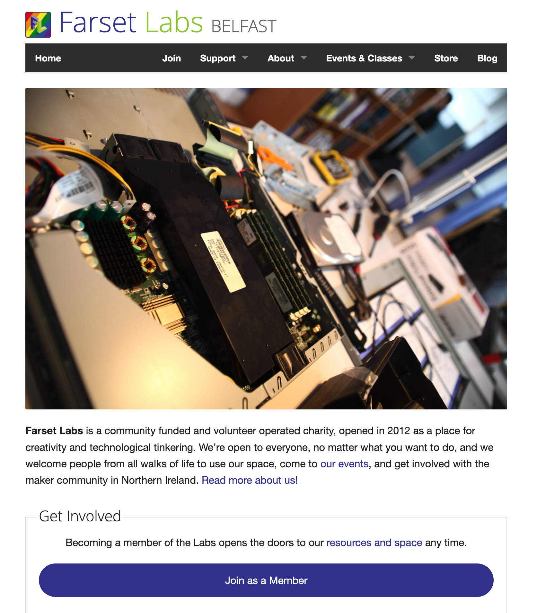

# Farset Labs Main Website

A [Jekyll][jekyll] and [Bootstrap][bootstrap] based informational website for
[Farset Labs][farsetlabs], a hackerspace and charity located in Belfast,
Northern Ireland.



## Quickstart

Install the [prerequisites][prerequisites] needed for Jekyll. This includes a
recent version of Ruby (2.5 or later). We recommend using the latest stable
version of Ruby that works with Jekyll and your chosen platform. You can check
your version of Ruby by running:

```sh
ruby --version
```

We suggested that you use [RVM][rvm] or [rbenv][rbenv] to manage different
versions of Ruby locally.

Once you've installed the prequistes, open the project directory and run:

```sh
gem install bundler
bundle install
bundle exec jekyll serve -w
```

Open http://localhost:4000 in a browser to view the site.

### Building With Docker

[Docker][docker] provides reproducible environments to aid development. To work
with this site using Docker first ensure that Docker is installed on your
machine, and then run:

``` docker build -t farsetlabs-site .  docker run -p 4000:4000 -v `pwd`:/app
farsetlabs-site ```

This will start a container, build the site and then serve it on port 4000.
Editing files on your machine will cause the container to rebuild the site and
make the changes available in the browser (wait for the confirmation message of
the build)

```sh
Regenerating: 1 file(s) changed at 2019-06-13 09:33:17
                    index.html
                    ...done in 10.680932188 seconds.
```

## Contributing

### Making your changes

All contributions to the website and content should be done through a branch.
You should follow the [Feature Branch Workflow][feature-branch-workflow] when
contributing.

We have one main branch, `main`, which represents the [live
website][farsetlabs]. Ongoing improvements to the site that are not live yet
live in feature branches, either on this repository or its forks.

Please branch from the latest `main` for your changes.

If you do not have access to our repository, please fork us on Github and
submit your branch through a pull request.

If you are not a developer, you should raise corrections and content
improvements as [issues].

### Editing Sidebar Links

Sidebar links are included from `_includes/sidebar-links.md` This is a
markdown list which is parsed when the jekyll site is built. To update sidebar
links just edit this file.

### Submitting your changes

Once you have pushed your changes (either to our repo or your fork as a
contributor) you should open a [pull request]. Our web team will review it.
Please leave at least a brief description of what the changes are, and detail
any changes made to layout or the functionality of the website.


[bootstrap]: http://getbootstrap.com/
[farsetlabs]: https://www.farsetlabs.org.uk/
[docker]: https://docker.com/
[feature-branch-workflow]: https://www.atlassian.com/git/tutorials/comparing-workflows/feature-branch-workflow
[issues]: https://github.com/FarsetLabs/farsetlabs.github.io/issues
[jekyll]: http://jekyllrb.com/
[pull request]: https://github.com/FarsetLabs/farsetlabs.github.io/pulls
[rvm]: https://rvm.io/
[rbenv]: https://github.com/rbenv/rbenv
[prerequisites]: https://jekyllrb.com/docs/installation/
