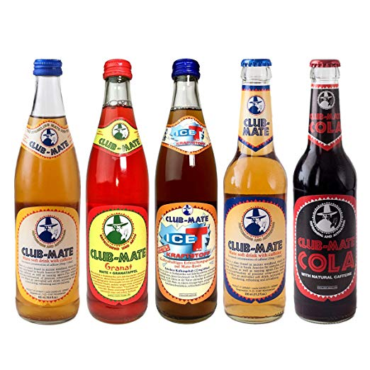

# Club-Mate

[Club-Mate] is the refreshing hacker drink originating from Germany. It uses
an extract from the Yerba-tea plant native to South America.
[See why][fuel-of-choice] it's the popular drink of choice among hacker
sub-communities.

## How to get

Farset Labs imports Club-Mate for its members, it is sold by the bottle at the
tuckshop on-site (recommended donation; £2/btl)

We also sell by the crate for larger orders, and are happy to sell onto the
public! 

We stock; 

* Regular (330ml) - £35
* Cola (330ml) - £37

If you would like to order (for collection only), please order here!

<iframe src="https://docs.google.com/forms/d/e/1FAIpQLSeOy9bXEpTl5UowpSB1ubudoWwwCY1HTwvpQGr9xuEI_NY-Xg/viewform?embedded=true" width="640" height="854" frameborder="0" marginheight="0" marginwidth="0">Loading…</iframe>

  [Club-mate]: http://www.clubmate.de/
  [fuel-of-choice]: https://www.vice.com/en/article/xywxm7/how-a-german-soda-became-hackers-fuel-of-choice
  [form]: https://docs.google.com/forms/d/1fUgrvDnktPW1WM3YsBpFMWUZP5qGrD7Ktu1vsmCVp4s/closedform
  [mailing list]: https://docs.google.com/forms/d/1rRXpidMTPJrlrwpWK2t31LoedhtMy41OJRMjZA9ok_c/viewform
