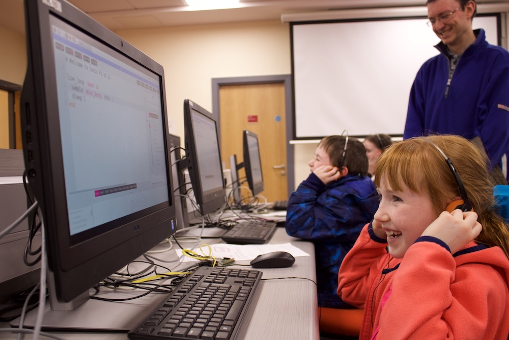

   
Come one, come all to the Northern Ireland Raspberry Jam!
In collaboration with Farset Labs, the School of Physics and Mathematics at Queens and the Northern Ireland Raspberry Jam team, these free monthly events involve tinkering, coding, electronics and generally just having a stack of fun making stuff!
Whether you want to try out computer programming for the first time, hack some electronics or just generally have some fun inventing, we have something for everyone!

All equipment is provided and we have activities for ages 6-106, from complete beginners right up to seasoned Pi experts. Plus, like all our Raspberry Jam events, it is completely free!
So what are you waiting for?

Note these events now take place at the Maths and Physics Teaching Centre, Queens University. Instructions on how to get there can be found on the Eventbrite page.

## Tickets

[Book Tickets](https://www.eventbrite.co.uk/o/northern-ireland-raspberry-jam-12781086687)

<iframe src="//eventbrite.co.uk/tickets-external?eid=35329063179&ref=etckt" frameborder="0" height="445" width="100%" vspace="0" hspace="0" marginheight="5" marginwidth="5" scrolling="auto" allowtransparency="true"></iframe>
<a class="powered-by-eb" style="color: #ADB0B6; text-decoration: none;" target="_blank"</a>

## No tickets available above?
Check our [main Eventbrite page to see full list of upcoming Northern Ireland Raspberry Jam events](https://www.eventbrite.co.uk/o/northern-ireland-raspberry-jam-12781086687).

# FAQs

## What is a Raspberry Jam?

A Raspberry Jam is an event for kids/adults of all ages to come together and learn a bit more about the Raspberry Pi and coding/electronics in general.

## I have no previous experience with coding/electronics/Raspberry Pi?

That is no problem! All our Raspberry Jams are suited for beginners, right up to Pi exports, plus all equipment is provided. All you need to bring is yourself.

## How often to do these Raspberry Jam events run?

The Northern Ireland Raspberry Jam runs on the 2nd Saturday of every month (excluding July/August) throughout the year. They are free as well and involve new workshops/activities each month. Details - .

## There is no tickets left, what do I do?

Tickets for the Raspberry Jam events have a habit of going very fast. We have moved to 2 ticket batch releases to keep it fair. First at the end of the previous jam and the second roughly 2 weeks later (aka "Late bird tickets"). Unfortunately if both of these are sold out, we are completely full. You may want to then sign up for the waitlist, in case someone drops out at the last minute.   
To make sure you know when the next tickets are being released, you may want to sign up to the ticket [mailing list](http://eepurl.com/bRD1AD).

## What age range is this event suitable for?

All of our Raspberry Jam events are suitable for kids as young as 6, right up to adults of 106! Although the majority of the attendees at the Raspberry Jam events are young people, they are open to adults as well, especially parents of kids attending.

## Miscellaneous

- By attending this event, you provide express permission to photographs/videos being taken and used by the Northern Ireland Raspberry Jam team. If this is an issue, please inform one of the team on your arrival.

 - That normal [Farset Labs' Child Protection Policy](/about/child_protection.html) applies. This includes that all children under the age of 15 must have a designated guardian in on site for the entire event.
   We also require children aged between 15 and 17 (inclusive) parents are within 10 minutes from venue and can be easily contactable in event of an emergency.

